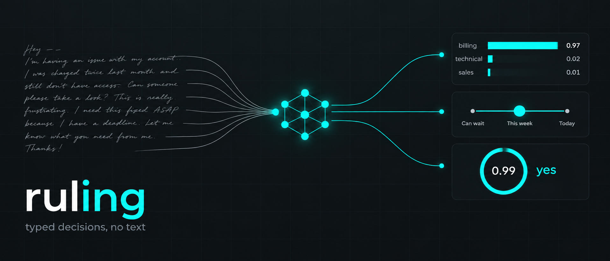

Typed decisions from a local model, no text generated. Not affiliated with TypeSafe AI.

ruling turns any open chat model into a decision engine like TypeSafe's
[Jev](https://typesafe.ai/blog/introducing-system-one-models-and-jev). You send
a state and typed questions; you get back a probability for every option you
declared. Nothing is generated, so there is nothing to parse and the model
cannot invent an answer you did not list.


*On the 256 public judgments that carry Jev's own answers, a 19 GB open model
with no training gets 231 right to Jev's 238 — not a significant difference
(exact McNemar, p = 0.21). [Where Jev is ahead](#where-jev-leads) is below.*

## Try it in two minutes

You need an Apple Silicon Mac, Python 3.12+, and [uv](https://docs.astral.sh/uv/).

```bash
uv sync
uv run ruling serve          # downloads a 2.3 GB model on first start, then serves http://127.0.0.1:8010
```

```bash
curl -s localhost:8010/v1/systemone -H 'content-type: application/json' -d '{
  "state": {"message": "My card was charged twice for one order. Refund the duplicate."},
  "questions": {
    "team":    {"type": "choice", "instructions": "Which team should handle this?",
                "criteria": {"billing": "Charges and refunds", "technical": "Bugs", "sales": "Pricing"}},
    "urgency": {"type": "score",  "instructions": "How urgent is this?",
                "criteria": ["Can wait", "This week", "Today"]},
    "refund":  {"type": "noul",   "instructions": "The customer asks for a refund."}
  }}'
```

```json
{
  "answers": {
    "team":    {"type": "choice", "choice": "billing",
                "probabilities": {"billing": 0.997, "technical": 0.002, "sales": 0.001}, "confidence": 0.995},
    "urgency": {"type": "score", "score": 1.74, "legend": {"0": "Can wait", "1": "This week", "2": "Today"},
                "probabilities": {"0": 0.066, "1": 0.131, "2": 0.803}, "confidence": 0.606},
    "refund":  {"type": "noul", "noul": 0.955}
  },
  "usage": {"input_tokens": 405, "output_tokens": 0}
}
```

Three question types: **choice** picks one option, **score** places the state
on an ordered scale, **noul** judges whether a statement is true. Ask as many
as you like in one request; the state is read once.

There is a playground at `http://127.0.0.1:8010/`, a one-shot CLI (`uv run
ruling ask --help`), a Python client (`from ruling import RulingClient`), a
zero-dependency TypeScript client in [`sdks/typescript`](sdks/typescript), and
TypeSafe's own official SDK works against it unchanged — point
`TYPESAFE_BASE_URL` at the server. Details for all of them are in
[docs/reference.md](docs/reference.md).

## Pick a model

| you want | set | notes |
|---|---|---|
| the default | nothing | `mlx-community/Qwen3.5-4B-4bit`, 2.3 GB, 3 questions in ~136 ms |
| Jev-level accuracy | `RULING_MODEL=mlx-community/Qwen3.6-35B-A3B-4bit` | 19 GB, ~204 ms, the model in the chart above |
| any other MLX checkpoint | `RULING_MODEL=<hub id or local path>` | tested with Qwen, Llama 3.2, Gemma 3 |
| a model you serve elsewhere | `RULING_MODEL=openai:<name>` + `RULING_OPENAI_BASE_URL` | vLLM, llama.cpp, `mlx_lm.server`, or a commercial API; needs `top_logprobs` |
| a model on OpenRouter | `RULING_MODEL=openrouter:<name>` | with a spend budget |

The other settings — token limits, API key, calibration, logprob caps — are in
[docs/reference.md](docs/reference.md#install-and-run).

## Make it yours: fine-tune on your own decisions

The probabilities a stock model gives are usually right but often
overconfident. A short LoRA fine-tune on a few hundred of your own labeled
decisions fixes that, and it is the step that makes a confidence threshold
safe to act on. Four commands.

**1. Write your decisions as JSONL**, one record per line, in the same shape
as a request plus the right answers:

```json
{"state": "Order 4471 arrived damaged, customer wants a replacement.",
 "questions": {"team": {"type": "choice", "instructions": "Which team?",
                        "criteria": {"returns": null, "billing": null, "shipping": null}},
               "urgent": {"type": "noul", "instructions": "This needs a reply today."}},
 "labels": {"team": "returns", "urgent": false}}
```

Choice labels are the option key, score labels the level index, noul labels
`true`/`false`. Keep a separate file of records you will never train on.

**2. Train.** The trainer refuses to start if any training state also appears
in a holdout file, so leakage cannot happen by accident.

```bash
uv run ruling train --data my-decisions.jsonl --holdout my-holdout.jsonl \
  --model mlx-community/Qwen3-4B-Instruct-2507-4bit --output runs/adapters/mine
```

About 40 minutes for 25,000 records on a Mac; a few hundred records take
minutes. Use a pure-attention base like `Qwen3-4B-Instruct-2507`; Qwen3.5's
hybrid attention trains 15 to 30 times slower in MLX.

**3. Check it on the holdout, then fit a temperature on it.**

```bash
uv run ruling eval my-holdout.jsonl --model mlx-community/Qwen3-4B-Instruct-2507-4bit --adapter runs/adapters/mine
uv run ruling calibrate my-holdout.jsonl --model mlx-community/Qwen3-4B-Instruct-2507-4bit --adapter runs/adapters/mine --output calibration.json
```

`eval` prints accuracy, calibration error, and **coverage at a 5% error
budget**: the share of decisions you can automate, accepting in confidence
order, before the accepted set exceeds 5% errors. That number is your
threshold's safety margin. The calibration file is bound to the exact model
and adapter it was fit on and will not load against anything else.

**4. Serve with both.**

```bash
RULING_MODEL=mlx-community/Qwen3-4B-Instruct-2507-4bit RULING_ADAPTER=runs/adapters/mine \
RULING_CALIBRATION=calibration.json uv run ruling serve
```

What to expect, from our own adapter on 27,000 constructed records, tested on
four sets it never saw: accuracy moved by a question or two, calibration error
roughly halved, and confident errors (wrong while reporting p ≥ 0.9) fell
three- to thirteen-fold. Full card and reproduction in
[docs/adapter.md](docs/adapter.md).

## Escalate the doubtful questions to a bigger model

Once the small model's confidence is honest, one threshold lets a big model
answer only what the small one is unsure about:

```bash
RULING_ADAPTER=runs/adapters/mine RULING_CASCADE_TO=mlx-community/Qwen3.6-35B-A3B-4bit \
RULING_CASCADE_THRESHOLD=0.84 uv run ruling serve
```

Measured with the threshold fitted on one dataset and applied to the other:
the 35B answered 13% of questions and the pair matched the 35B alone (90 vs 91
on TypeSafe's rows, 145 vs 144 on Every's). The second model can also be any
`openai:` endpoint.

## How good is it

One batch, one Mac, four models on four held-out sets. Accuracy at the default
three option orderings; the [full record](docs/measurements.md) has every
setting and the commands for each cell.

| model | TypeSafe 102 | authored144 | perturbations108 | Every 154 |
|---|---:|---:|---:|---:|
| Qwen3.5-4B, the default | 0.814 | 0.917 | 0.907 | 0.929 |
| Qwen3-4B-Instruct + our adapter | 0.843 | 0.889 | 0.861 | 0.916 |
| Qwen3.6-35B-A3B | 0.873 | 0.958 | 0.954 | 0.922 |
| Jev, published | 0.882 | — | — | 0.961 |

Coverage at a 5% error budget, the number a threshold depends on:

| | TypeSafe 102 | Every 154 | authored144 | perturbations108 |
|---|---:|---:|---:|---:|
| Qwen3.5-4B | 0.608 | 0.818 | 0.924 | 0.907 |
| Qwen3-4B-Instruct + our adapter | 0.392 | 0.948 | 0.882 | 0.815 |
| Qwen3.6-35B-A3B | 0.716 | 0.948 | 1.000 | 1.000 |
| Jev, published | 0.784 | 1.000 | — | — |

## Where Jev leads

The tie in the chart is real, and so is this. On the same rows Jev is ahead on:

- **Every's 154 labeled judgments**, 148 to the 35B's 142. The cleanest accuracy
  comparison we have, and Jev wins it.
- **Confidence ordering.** Pooled over all 256 judgments, Jev's coverage at 5%
  error is 0.961 to our 0.863, and it is confidently wrong 0.4% of the time to
  our 3.5%. This is the gap that matters for automation; fine-tuning narrows
  it without closing it.
- **Probabilities, not just answers.** Jev's distributions sit closer to
  TypeSafe's reference than ours even where the top answer agrees.
- **Knowledge-heavy inputs.** Other replications ([Kev](https://github.com/jaredpalmer/kev),
  [decider](https://github.com/Mapika/decider)) report Jev 10 to 18 points ahead
  on MMLU-style items; we have not run that suite and expect the same.

## How it works


The state is encoded once and its cache is kept. Every question becomes a
short suffix listing its options as `A.`, `B.`, `C.`; all suffixes run in one
batched forward pass against that cache. At each answer position the logits
are restricted to the option letters and normalized — that is the answer.
Nothing is decoded, so `output_tokens` is 0 and the answer is always one of
your options.

Each question is scored under three orderings of its options and the results
averaged, which removes the letter bias small models have. Confidence uses the
formulas from TypeSafe's MIT-licensed client, so it means the same thing as the
hosted API's.


*Why this is fast: reading stops after prefill, which keeps the GPU
compute-bound. Generating the same answers as JSON decodes one token at a time
and runs at about a fortieth of the throughput on the same chip.*

The longer version, with two-stage Choice above 62 options, the rotation cap,
and the confidence formulas, is in [docs/reference.md](docs/reference.md#how-it-works).

## Limits

- Probabilities are model scores. Calibration makes them honest on average on
  data like your calibration set; it does not make any single answer right.
- One request at a time. Questions inside a request are batched; concurrent
  requests queue behind a lock.
- Text only. No images, no audio, no generated explanation.
- The native engine is MLX, so the fast path is Apple Silicon. Other hardware
  runs through `openai:` against vLLM or llama.cpp, without the shared prefix
  cache.

## Layout

```
ruling/            the package: engine.py (MLX scoring), hosted.py (OpenAI-compatible endpoints),
                   cascade.py, calibration.py, evals.py, train.py, server.py, cli.py, sdk.py
sdks/typescript/   zero-dependency JS client with TypeScript types
datasets/          labeled JSONL fixtures and the record format
docs/              reference.md (settings, API, clients), measurements.md (the full record),
                   background.md (what Jev is, the other recreations), adapter.md (the model card)
assets/            figures and the scripts that redraw them from the evaluation JSON
tests/             unit (no model) and integration (real model, downloads Qwen3.5-0.8B on first run)
```

```bash
uv run pytest tests/unit
uv run pytest tests/integration
```

## Related work

- [Kev](https://github.com/jaredpalmer/kev), [SemIf](https://github.com/TheoLeeCJ/SemIf),
  [decider](https://github.com/Mapika/decider), [snellingio/system-one](https://github.com/snellingio/system-one):
  the other open recreations. How they compare is in [docs/background.md](docs/background.md).
- Archer Hume, [Jev's Architecture Unmasked](https://archerhume.com/posts/jevs-architecture-unmasked/):
  the black-box analysis the architecture notes lean on.
- Zhao et al., *Calibrate Before Use* (2021); Guo et al., *On Calibration of
  Modern Neural Networks* (2017); Gneiting and Raftery, *Strictly Proper Scoring
  Rules* (2007): the methods behind the prior debiasing, the temperature scaling,
  and the choice of loss.

## License

MIT. ruling is an independent project with no connection to TypeSafe AI; "Jev"
and "System One" are their names, used here to say what this reproduces. The
`authored144` and `perturbations108` datasets and the WANLI row selection are
converted from TheoLeeCJ/openjev under MIT, with their copyright notice in
[THIRD_PARTY.md](THIRD_PARTY.md). WANLI is CC-BY-4.0 and SST-5 keeps its own
terms; neither is committed here. Model weights keep their own licenses.
