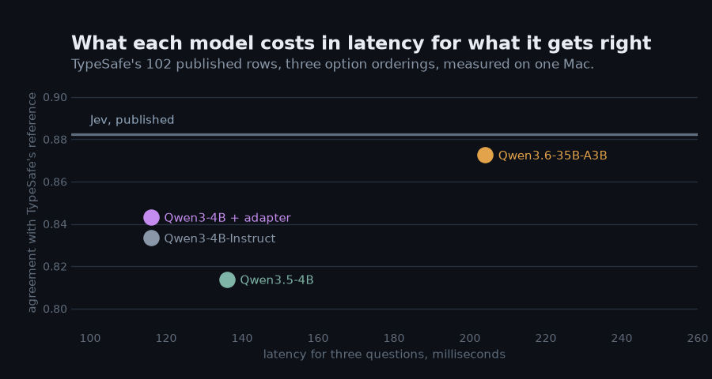
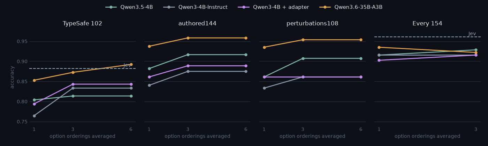
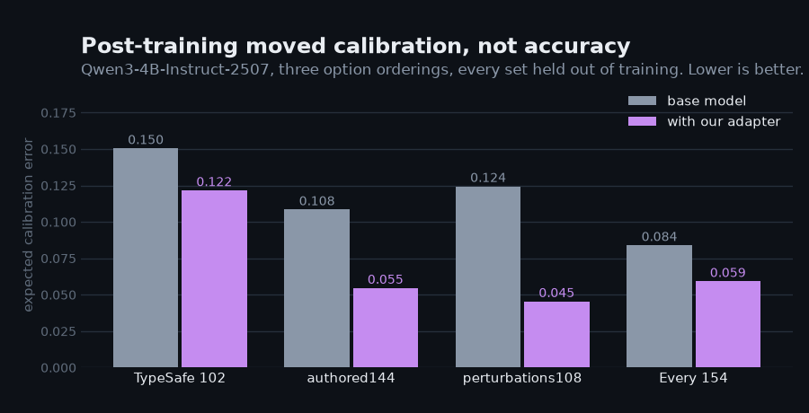
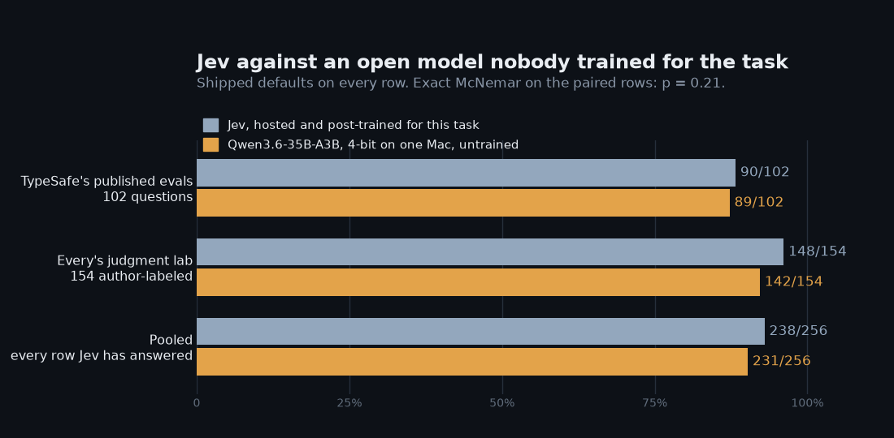

# Measurements, in full

The complete measurement record: how to run the harness, every model on every held-out set at every
setting, what ordering averaging and post-training bought, latency, and the comparison with Jev's own
published answers. The README carries the summary; this file carries everything, unchanged.

## Evaluation and calibration

Datasets are JSONL records with a state, questions in the API shape, and a
label per question. Four are bundled and two more build from pinned public
sources; see [datasets/README.md](../datasets/README.md).

```bash
uv run ruling eval datasets/authored144.jsonl                   # metrics per question type
uv run ruling eval datasets/authored144.jsonl --rotations 1     # same, one ordering
uv run ruling build-dataset wanli --output datasets/wanli256.jsonl
uv run ruling calibrate datasets/wanli256.jsonl --output calibration.json
RULING_CALIBRATION=calibration.json uv run ruling serve
```

`eval` reports, per question type: accuracy, balanced accuracy, mean
per-family balanced accuracy when records carry a `family`, expected
calibration error, Brier score, negative log-likelihood, and mean confidence.
For Choice questions it also scores every record with the options reversed and
reports how many argmax answers flip. Reports record the model's Hugging Face
revision and the scoring settings.

`calibrate` fits one temperature per question type by minimizing negative
log-likelihood. The file records the model, revision, rotation count, and
debiasing setting it was fit under, and the server refuses to load it against
anything else.

## Measurements

Every number in this section comes from one batch, run on 18 September 2026 on
a single Apple Silicon Mac: one code version, one sitting, four models against
the same four held-out sets, with no calibration file loaded (temperature 1.0)
and prior debiasing off. Reproduce a cell with

```bash
uv run ruling eval <dataset> --model <model> --rotations <n>
```

**How the defaults were chosen, and what leaked.** `RULING_ROTATIONS=3` was
originally picked because it scored best on `authored144`, so that set is not
clean evidence for it. TypeSafe's 102 rows and Every's 154 were scored
afterwards and confirm it independently. Prior debiasing was tried the same way
and lost on every model and dataset, so it ships off.

### Every model on every held-out set

Accuracy, as argmax agreement with each set's own reference labels. `r` is the
number of option orderings averaged per question.

| model | typesafe102 (102) | authored144 (144) | perturbations108 (108) | Every (154) |
|---|---|---|---|---|
| | r=1 / r=3 / r=6 | r=1 / r=3 / r=6 | r=1 / r=3 / r=6 | r=1 / r=3 |
| Qwen3.5-4B, the default | 0.804 / 0.814 / 0.814 | 0.882 / 0.917 / 0.917 | 0.861 / 0.907 / 0.907 | 0.916 / 0.929 |
| Qwen3-4B-Instruct-2507 | 0.765 / 0.833 / 0.833 | 0.840 / 0.875 / 0.875 | 0.833 / 0.861 / 0.861 | 0.916 / 0.916 |
| Qwen3-4B-Instruct + our adapter | 0.794 / 0.843 / 0.843 | 0.861 / 0.889 / 0.889 | 0.861 / 0.861 / 0.861 | 0.903 / 0.916 |
| Qwen3.6-35B-A3B, 19 GB | 0.853 / 0.873 / **0.892** | 0.938 / 0.958 / 0.958 | 0.935 / 0.954 / 0.954 | **0.935** / 0.922 |
| Jev, published | 0.882 | — | — | 0.961 |

Jev has one number per set because rotations are ruling's setting, not
TypeSafe's, and it has no entry on the two authored fixtures because those are
[TheoLeeCJ's](https://github.com/TheoLeeCJ/openjev) and Jev was never run on
them. Every skips r=6: its questions carry at most three options, and the
engine caps orderings at the option count, so r=6 there is the same computation
as r=3.



*What each model costs for what it gets right. Jev's line is its published
accuracy; its latency is a vendor range, 70 to 500 ms, so it is drawn as a line
rather than a point.*

### What ordering averaging buys



Going from one ordering to three is worth 1 to 5 questions on every model and
set. Going from three to six changes nothing anywhere except TypeSafe's rows,
where the 35B gains two more — and those are the only questions in any of these
sets with five options. `Engine._rotations_for` caps orderings at the number of
options, so the flat cells are flat by construction, not by chance.

The dashed line is Jev's published figure on the two sets where it has one. The
flat right-hand halves are the cap at work, and the 35B crossing Jev on
TypeSafe's rows at six orderings is the only crossing anywhere in these panels.

What averaging reliably buys is order stability. Rescoring every row with its
options reversed, counting answers that flip:

| model | authored144 r=1 | r=3 | Every r=1 | r=3 |
|---|---:|---:|---:|---:|
| Qwen3.5-4B | 15 | 6 | 26 | 5 |
| Qwen3-4B-Instruct | 15 | 5 | 29 | 12 |
| Qwen3-4B-Instruct + adapter | 12 | 3 | 24 | 6 |
| Qwen3.6-35B-A3B | 6 | 4 | 9 | 3 |

### What post-training bought

The adapter weights are not published; the corpus and the run that produced
them are. `ruling build-corpus public|states|worlds` rebuilds the training
records from pinned public datasets and the generators in this repository, and
the command below reproduces the adapter on a Mac in about 40 minutes:

```bash
uv run ruling train \
  --data runs/pool/public.jsonl runs/pool/states.jsonl runs/pool/worlds.jsonl \
  --holdout datasets/authored144.jsonl datasets/perturbations108.jsonl \
  --model mlx-community/Qwen3-4B-Instruct-2507-4bit --output runs/adapters/v1
```

`ruling train` fine-tuned a LoRA adapter on 27,021 constructed records —
reframed public datasets, generated program states, and synthetic worlds — with
every evaluation set above passed to `--holdout`. In-distribution validation
accuracy went from 0.607 to 0.844.

Held out, the adapter is worth 1 to 3 questions of accuracy at one ordering and
approximately nothing at three. What it does move is calibration, in all eleven
comparisons:



| set | expected calibration error, base → adapter |
|---|---|
| typesafe102 r=1 | 0.228 → 0.162 |
| typesafe102 r=3 | 0.150 → 0.122 |
| authored144 r=3 | 0.108 → **0.055** |
| perturbations108 r=3 | 0.124 → **0.045** |
| Every r=3 | 0.084 → 0.059 |

Training on a proper scoring rule made the probabilities honest without making
the judgments better, and the effect carried to distributions the adapter never
saw. The accuracy gain concentrates at r=1 and vanishes by r=3, which says
training and ordering averaging are correcting the same defect — positional
bias — and do not stack. With the adapter you can run one ordering and keep
three-ordering accuracy, at half the latency.

### Noul and Score, held out

Earlier batch, `Qwen3.5-4B-4bit`, kept because these two sets were not re-run.

| Dataset | Rows | Type | Metric | r=1 | r=3 |
|---|---:|---|---|---:|---:|
| WANLI | 256 | noul, "the evidence establishes this claim" | balanced accuracy | **0.853** | 0.827 |
| | | | ECE | 0.048 | 0.081 |
| SST-5 | 300 | score, five sentiment levels | accuracy | **0.530** | 0.487 |
| | | | balanced accuracy | 0.477 | 0.464 |
| | | | ECE | 0.086 | 0.121 |

SST-5 is a five-way ordinal task where fine-tuned encoders reach about 0.59.
Zero-shot, from a 4-bit 4B model, 0.53 with an ECE under 0.1 is usable.


### Tried and rejected: one-pass Choice above 62 options

The letter readout has 62 single-token codes, so a Choice with more options
runs as a tournament: every option judged alone as a Noul, the strongest eight
into a final Choice. Qwen's tokenizer offers 691 single-token codes across
Greek, Cyrillic, Latin-1, kana and CJK, so a 255-code alphabet was tried to
read every option in one pass. On the 35B, one ordering, eight real
77-to-151-option questions from the Decision Index sample:

| readout | correct | time |
|---|---:|---:|
| tournament, 62 codes | 5 of 8 | 73 s |
| one pass, 255 codes | 3 of 8 | 5 s |

Fifteen times faster and worse, with the failure signature of label bias: the
same unfamiliar glyph was chosen twice for different questions, and a correct
answer near the end of the alphabet lost to one near the start. Eight rows is
a small test, but it is the direction predicted before running it, so the
tournament stays. The speed is real and worth having; getting it without the
bias would take reading options from one decision position instead of from
letter tokens, which is a trained head, not a prompt change.

### Latency and throughput

Median of five requests, short JSON state, engine warm, same batch as the
accuracy numbers above.

| Request | | Qwen3.5-4B | Qwen3-4B-Instruct | Qwen3.6-35B-A3B |
|---|---|---:|---:|---:|
| 3 questions (Choice + Score + Noul) | r=1 | 80 ms | 78 ms | 141 ms |
| | r=3 | 136 ms | 116 ms | 204 ms |
| 21 Noul questions, one state | r=1 | 216 ms, 97/s | 178 ms, 118/s | 263 ms, 80/s |
| | r=3 | 495 ms, 42/s | 399 ms, 53/s | 606 ms, 35/s |

Every setting lands inside Jev's claimed 70 to 500 ms window for the
three-question request, including the 35B that reaches Jev's accuracy on
TypeSafe's rows. Run-to-run variation is real: the 35B measured 228 ms at r=3 a
day earlier on the same machine, about 10% above this batch. Measured on an
idle machine; under concurrent load the same requests took two to three times
longer, because requests queue behind a lock rather than batching together.


*What each model costs for what it gets right. Jev's line is its published
accuracy; its latency is a vendor range, 70 to 500 ms, so it is drawn as a line
rather than a point.*

## Against Jev itself

Two public sources carry Jev's own answers on inputs anyone can replay.
`ruling build-dataset typesafe` and `ruling build-dataset every` rebuild them
with Jev's answer attached to every question, and `ruling eval` reports how
often ruling lands on the same answer. Both were run with the default
settings; the one-ordering numbers are in parentheses.



**TypeSafe's published evaluation cases, 102 questions.** TypeSafe's
reference is the mean of GPT-6 Astra and Claude Fable 5.1 at high reasoning,
so this measures agreement with large models on workflows TypeSafe built,
not accuracy against truth.

| System | Agrees with TypeSafe's reference | Agrees with Jev's argmax |
|---|---:|---:|
| ruling, 35B-A3B, r=6 | **0.892** (91/102) | 0.853 |
| Jev, published | 0.882 (90/102) | |
| ruling, 35B-A3B, r=3 | 0.873 (89/102) | 0.853 |
| ruling, 35B-A3B, r=1 | 0.853 (87/102) | 0.833 |
| TheoLeeCJ/openjev, 4B BF16 | 0.85 | |
| ruling, Qwen3-4B-Instruct + adapter, r=3 | 0.843 (86/102) | 0.824 |
| ruling, Qwen3.5-4B, r=3 | 0.814 (83/102) | 0.824 |

On the default 4B model Jev is better here by about seven points, and on the
35B the two are level: 91 of 102 against Jev's 90 of 102. One question is a tie,
not a lead.

Pooled with Every's 154 labeled judgments — every row anywhere that carries
Jev's own answer — the 35B at shipped defaults gets 231 of 256 and Jev gets
238. An exact McNemar test on the paired rows gives **p = 0.21**: no
significant difference, with Jev nominally ahead. Taking the best rotation
setting per dataset instead gives 235 of 256 and p = 0.66; that number is
recorded here rather than quoted, because choosing a setting per dataset is
tuning on the evaluation.

**[Every's parallel judgment lab](https://typesafe-parallel-judgment-lab.every-4573.chatgpt.site/),
758 judgments on 208 documents.** Every recorded Jev's answers for nine
experiments in August 2026. Three of them
carry author labels (the support-reply judge grid and two retrieval grids,
154 judgments); the rest measure agreement only.

| | Jev | Qwen3.5-4B | 35B-A3B |
|---|---:|---:|---:|
| Accuracy on the 154 author-labeled judgments | **0.961** | 0.929 (0.916) | 0.922 (0.935) |
| Agreement with Jev, all 758 judgments | | 0.858 (0.832) | 0.922 (0.921) |

Jev leads on the author-labeled rows by three points against the 4B and four
against the 35B; these 154 rows are the one place in this README where Jev is
ahead of everything we run. The 35B tracks Jev's own answers much more closely
than the 4B does, 0.922 against 0.858 across all 758 judgments. Note that both
open models score *higher* than the 35B on the labeled subset at three
orderings while agreeing with Jev *less* — agreement with Jev and accuracy
against the authors are different measurements, and this set is small enough
that a few questions separate them.

**What the published data says about Jev's mechanism.** Every's file records
token usage per experiment. Jev reports almost exactly 16 output tokens per
judgment in every experiment (16.0 to 17.0 across six of them, from 5 to 21
questions per call), and roughly 350 to 400 input tokens per call beyond the
document and question text. A constant per-question output budget is
consistent with a fixed answer block computed in parallel per question rather
than a decoded string. Probabilities are published to two decimals. The
models endpoint lists `jev-latest`, released 2026-09-10, and `jev-preview`.

**Live comparison.** `ruling eval <dataset> --against typesafe` sends every
record to the hosted API with `TYPESAFE_API_KEY` and reports Jev's live
answers next to ruling's on the same rows, including the author-labeled
datasets above where Jev has never been measured. The client speaks
TypeSafe's protocol, which is the same as ruling's, and is tested end to end
against a ruling server. It needs API credits on the TypeSafe account; the
run for this README stopped at `402 Payment Required` before any call was
scored.

