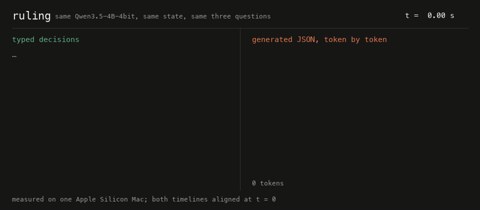
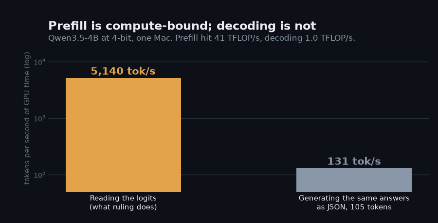

# Reference: settings, models, API, clients

Everything the front page summarizes, in full. Moved here to keep the README short; nothing was cut.

## Install and run

Requires an Apple Silicon Mac, Python 3.12+, and [uv](https://docs.astral.sh/uv/).

```bash
uv sync
uv run ruling serve          # http://127.0.0.1:8010, playground at /
```

The first start downloads the default model, `mlx-community/Qwen3.5-4B-4bit`
(about 2.3 GB). Settings come from the environment:

| Variable | Default | Meaning |
|---|---|---|
| `RULING_MODEL` | `mlx-community/Qwen3.5-4B-4bit` | Any MLX chat model, `openai:<model>` for a model behind an OpenAI-compatible server, or `openrouter:<model>`. Tested: Qwen3.5, Llama 3.2, Gemma 3 |
| `RULING_ROTATIONS` | `3` | Answer orderings averaged per question. `1` is fastest. See How it works |
| `RULING_PRIOR_DEBIAS` | `false` | Subtract a content-free letter prior. Measured, does not help; kept so you can re-check with another model |
| `RULING_CALIBRATION` | unset | Path to a `calibration.json` written by `ruling calibrate` |
| `RULING_API_KEY` | unset | When set, `/v1/*` requires `Authorization: Bearer <key>` |
| `RULING_MAX_INPUT_TOKENS` | `65536` | Whole-request budget: state plus every question. Above this the request is rejected with 413 |
| `RULING_MAX_BRANCH_TOKENS` | `32768` | Per-branch budget: state plus one question. A single oversized question is rejected even when the request fits |
| `RULING_OPENAI_BASE_URL` | unset | Required for `openai:` models. The endpoint serving them, ending in `/v1` |
| `RULING_OPENAI_API_KEY` | unset | Sent as a bearer token when the host wants one. Local servers usually do not |
| `RULING_OPENAI_TOP_LOGPROBS` | `20` | How many top logprobs the host returns, which is also the option ceiling. OpenAI allows 20, `mlx_lm.server` allows 11 |
| `RULING_OPENAI_EXTRA_BODY` | `{}` | JSON merged into every request, for host-specific fields such as `{"chat_template_kwargs": {"enable_thinking": false}}` |
| `RULING_ADAPTER` | unset | A LoRA directory from `ruling train`; see [docs/adapter.md](adapter.md) |
| `RULING_CASCADE_TO` | unset | A second model that answers the questions the first is unsure about |
| `RULING_CASCADE_THRESHOLD` | unset | Top probability below which a question is escalated; required with `RULING_CASCADE_TO` |
| `RULING_HOST`, `RULING_PORT` | `127.0.0.1`, `8010` | Bind address |

### Bring your own model

The readout needs one thing from a model: the probabilities of the next token,
restricted to your options. Three ways to give ruling that, all behind the same
API, all evaluated by the same harness:

| Your model | `RULING_MODEL` | Notes |
|---|---|---|
| An MLX checkpoint | `mlx-community/...` or a local path | Fastest: one shared prefix cache, every question in one batched forward pass |
| Anything you serve yourself | `openai:<model name>` | vLLM, SGLang, llama.cpp, LM Studio, `mlx_lm.server`, or a commercial API. Needs `/chat/completions` with `top_logprobs` |
| A model on OpenRouter | `openrouter:<model>` | Adds provider pinning and a spend budget |

```bash
python -m mlx_lm server --model mlx-community/Qwen3.5-4B-4bit --port 8080 &

export RULING_MODEL=openai:mlx-community/Qwen3.5-4B-4bit
export RULING_OPENAI_BASE_URL=http://127.0.0.1:8080/v1
export RULING_OPENAI_TOP_LOGPROBS=11
export RULING_OPENAI_EXTRA_BODY='{"chat_template_kwargs": {"enable_thinking": false}}'
uv run ruling eval datasets/authored144.jsonl
```

What a hosted model costs you: the option ceiling drops from 255 to however
many logprobs the host returns, there is no shared prefix cache so the state is
re-read for every question, and a reasoning model has to be told to stop
reasoning, differently on each host. What it buys: your model, your hardware,
any platform. An integration test runs this path end to end against a real
server and checks the distributions match the local engine's.

One-shot, without a server:

```bash
uv run ruling ask "Since this morning every request with our API key returns 401." \
  --choice "team=Which team should handle this?|billing,technical,sales" \
  --score  "urgency=How urgent is this?|Can wait,This week,Today" \
  --noul   "blocked=The customer is blocked from using the product."
```

## API

`POST /v1/systemone`

```json
{
  "model": "optional; must match the loaded model",
  "state": "string, object, or array",
  "questions": {
    "<id>": {"type": "choice", "instructions": "...", "criteria": {"<key>": "description, JSON, or null"}},
    "<id>": {"type": "score",  "instructions": "...", "criteria": ["lowest level", "...", "highest level"]},
    "<id>": {"type": "noul",   "instructions": "a statement to judge"}
  }
}
```

Instructions, option descriptions, and levels may be strings or JSON
structure. Answers come back keyed by the same ids:

| Type | Fields |
|---|---|
| choice | `choice` (the argmax key), `probabilities` over keys, `confidence` |
| score | `score` (probability-weighted level index, so `1.74` sits between levels 1 and 2), `legend` index to level text, `probabilities` over indices, `confidence` |
| noul | `noul`, the probability the statement is true |

`usage.input_tokens` counts every token the model processed: the shared prefix
once, plus each question suffix for each ordering. `output_tokens` is always 0.

Errors: 422 for a malformed request or a Choice over 255 options, 413 for a
request over a token limit, 404 for a `model` that is neither the loaded one
nor a default alias (`jev-latest`, `default`), 401 when an API key is
configured and missing.

`GET /v1/models` returns `{"models": [...]}` with the hosted API's `name`,
`description` and `release_date`, plus the Hugging Face revision, adapter
digest and limits that only a local engine knows. `GET /health` returns the
model id. `GET /` is a playground page.

### TypeSafe's own SDK talks to ruling

The request shape, the response shape and both paths match the hosted API, so
TypeSafe's official client needs no patching, no shim, and no code change —
only two environment variables:

```bash
export TYPESAFE_BASE_URL=http://127.0.0.1:8010
export TYPESAFE_API_KEY=whatever-you-set-as-RULING_API_KEY
```

```python
from typesafe_sdk import Choice, TypeSafeClient   # the official package, unmodified

with TypeSafeClient() as client:                  # now answered locally
    response = client.system_one(state=..., questions={"team": Choice(...)})
```

`client.system_one`, `client.models.list()`, `response.choices`,
`response.nouls`, `response.scores` and `response.usage` all work. This is
covered by an integration test that installs the real
[`typesafe-sdk`](https://github.com/typesafe-ai/typesafe-sdk-python) package
and runs it against a live ruling server, so the compatibility claim fails
loudly if either side drifts.

## Clients

Python, in this package:

```python
from ruling import Choice, Noul, Score, RulingClient

with RulingClient() as client:                          # RULING_BASE_URL or http://127.0.0.1:8010
    response = client.system_one(
        state={"message": "Since this morning every request with our API key returns 401."},
        questions={
            "team": Choice(instructions="Which team should handle this?",
                           criteria={"billing": "Charges and refunds", "technical": "Bugs and integrations"}),
            "urgency": Score(instructions="How urgent is this?", criteria=["Can wait", "This week", "Today"]),
            "blocked": Noul(instructions="The customer is blocked from using the product."),
        },
    )

team = response.answers["team"]
if team.confidence < 0.5:
    route_to_human()
elif team.choice == "technical" and response.answers["blocked"].noul > 0.9:
    page_on_call()
```

TypeScript and JavaScript, zero dependencies, in [`sdks/typescript`](../sdks/typescript):

```js
import { RulingClient, choice, noul, score } from "ruling";
const { answers } = await new RulingClient().systemOne({ state, questions: { team: choice("Which team?", { billing: null, technical: null }) } });
```

The thresholds belong in your code, versioned and tested. Fit them on labeled
data from your own traffic; see [calibration](measurements.md#evaluation-and-calibration).

## How it works



*Same 4B model, same state, same three questions, measured on one Mac and
aligned at t = 0. ruling answered in 119 ms, median of five. Generating the
same answers as JSON took 755 ms and 105 tokens, median of three, and the
generated object invented a `refund` key inside `team` that no schema asked
for. Reproduce with `uv run --with pillow python assets/replay.py`.*

1. **One prefix, many suffixes, one forward pass.** The system prompt and the
   rendered state are pushed through the model once and the KV cache is kept.
   Each question becomes a short suffix (instructions, the options labeled
   `A.`, `B.`, `C.`, and "respond with only the letter"). All suffixes are
   right-padded into one batch and run in a single forward pass against
   replicas of the cached prefix, chunked so the replicated cache stays under a
   token budget. Adding a question adds a row to the batch, not a re-read of
   the state.
2. **Read, do not sample.** At each suffix's answer position the logits are
   restricted to the option-letter tokens and log-softmaxed. Nothing is
   decoded, so the answer is always one of your options.
3. **Ordering averaging.** Small models prefer some letters over others. With
   `RULING_ROTATIONS=n`, each Choice or Noul is scored under `n` cyclic shifts of
   its option order and each Score under both directions of its scale, and the
   log-probabilities are averaged. With `n` equal to the option count the
   result is exactly invariant to cyclic reordering of your options; there is a
   test for that.
4. **Two-stage Choice.** Above 62 options (the tokenizer's single-token codes)
   every option is first judged alone as a Noul, the strongest 8 go to a final
   Choice, and the rest get probability 0.
5. **Temperature scaling.** Log-probabilities are divided by a per-type
   temperature before the softmax. The temperature is 1 until you fit one.
6. **Confidence** follows the formulas in TypeSafe's MIT-licensed
   `system-one-adapter`, so a value here is comparable with one from the
   hosted API. Choice is `(max(p) - 1/n) / (1 - 1/n)`, how far the leading
   option stands above uniform. Score is one minus the probability-weighted
   distance from the modal level over the distance a uniform distribution
   would give, so mass spread across neighboring levels costs less than the
   same mass spread across distant ones. Both are 0 for a uniform
   distribution and 1 for a certain one. Noul answers carry no separate
   confidence; the probability is the whole answer.



*Why stopping after prefill is fast. Both bars are the same 4-bit 4B model on
the same Mac. Prefill processes every token of the prompt together and keeps
the GPU compute-bound; decoding reads the whole model out of memory for each
token it emits and leaves it memory-bound at about a fortieth of the
throughput. Regenerate with `uv run --with matplotlib python assets/charts.py`.*

